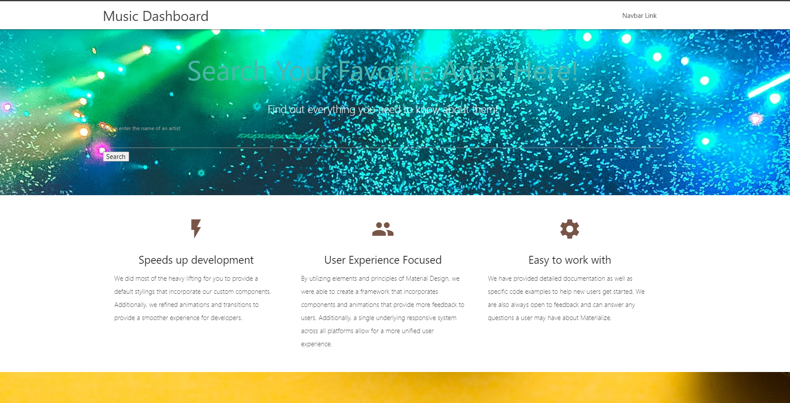

# Music Dashboard

## The Repository

This repository contains the HTML, CSS and Javascript code for the Music Dashboard project.

## Music Dashboard

Music Dashboard allows you to stay current on news and events around your favorite artists!

## Usage

To use Music Dashboard, simply type in the name of the artists in the search bar, shown in the following screenshot: 

By clicking the search button or hitting enter, the news section will be populated with five of the most salient articles about the artist. The dashboard will only display the headline and a short summary of the article, but the user can click the "source" link to be taken to the source page of the full article.

Music dashboard will also populate Events section with three of the artist's upcoming events.

## Deployed Application

the deployed application can be found by following the link below.

## Feedback

Leave comments/suggestions in the Slack channel!

## License

Copyright &copy; Music Dashboard, Inc. All rights reserved.
